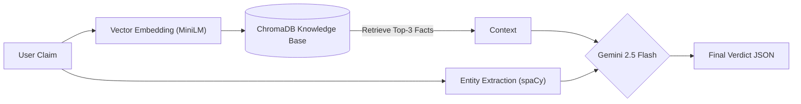

# 🕵️‍♂️ LLM-Powered Fact Checker (RAG Pipeline)

A lightweight, modular **Retrieval-Augmented Generation (RAG)** system designed to verify news claims against a trusted knowledge base. 

This solution uses a **hybrid approach**: combining `spaCy` for Entity Recognition with `Sentence-Transformers` for semantic search, powered by **Google Gemini 2.5 Flash** for high-speed reasoning.

---

## 🎥 Video Walkthrough
[Link to Video Walkthrough](YOUR_YOUTUBE_LINK_HERE)  
*(Please watch this 4-minute video for an architectural overview and demo)*

---

## 🏗️ Architecture
The system follows a decoupled architecture to ensure modularity and testability.

## 🚀 Features
Hybrid Analysis: Extracts Named Entities (e.g., dates, organizations) to provide metadata alongside semantic search.

Explainable AI: Returns a Verdict (True/False/Unverifiable) + Reasoning + Evidence Used.

Confidence Scoring: Exposes Cosine Similarity scores to detect low-confidence retrieval (potential hallucinations).

Cost-Efficient: Uses local CPU-based embeddings (all-MiniLM-L6-v2) and the efficient Gemini 2.5 Flash model.

Test Suite: Includes an automated batch testing script for validation.

## 🛠️ Setup & Installation
1. Clone the Repository
Bash

git clone [https://github.com/YOUR_USERNAME/llm-fact-checker-submission.git](https://github.com/YOUR_USERNAME/llm-fact-checker-submission.git)
cd llm-fact-checker-submission
2. Install Dependencies
It is recommended to use a virtual environment.

Bash

pip install -r requirements.txt
3. Download NLP Models
We use a small English model for entity extraction.

Bash

python -m spacy download en_core_web_sm
## 🏃‍♂️ Usage
Option A: Run the UI (Streamlit)
This launches the interactive web interface.

Bash

streamlit run app.py
You will need your Google API Key (from AI Studio) to run the app.

Option B: Run Automated Tests
To validate the system against edge cases (False, True, Unverifiable):

Bash

# Set API Key environment variable (Mac/Linux)
export GOOGLE_API_KEY="your_key_here"

# Run the test script
python tests/run_tests.py
## 📂 Project Structure
Plaintext

├── app.py                 # Streamlit User Interface
├── fact_checker.py        # Core RAG Logic & Class Definition
├── facts.csv              # The Knowledge Base (Source Truth)
├── requirements.txt       # Python Dependencies
├── tests/                 # Automated Test Suite
│   ├── sample_input.json
│   ├── sample_output.json
│   └── run_tests.py
└── README.md              # Documentation
## 🧠 Design Decisions
Why Gemini Flash? Chosen for its low latency and large context window, making it ideal for real-time classification tasks compared to heavier models.

Why ChromaDB? A lightweight, file-based vector database that requires no Docker setup, perfect for this scale.

JSON Enforcement: The LLM prompt is engineered to return strict JSON, ensuring the frontend never breaks due to unstructured text responses.

## 🔮 Future Improvements
Filter by Entity: Use the extracted entities (from spaCy) to pre-filter ChromaDB results (e.g., only search facts related to "Ministry of Power").

FastAPI Backend: Wrap FactChecker in a REST API for microservice deployment.

Human-in-the-loop: Flag claims with < 0.6 confidence score for manual review.
